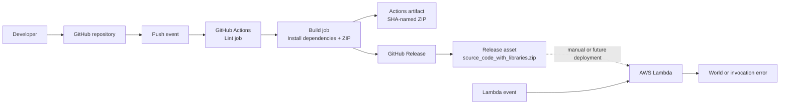
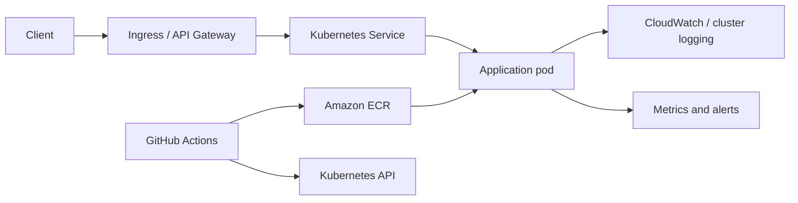

# Architecture

## Scope

This document describes the repository as it exists today and the target options for container-oriented deployment. The checked-in implementation is a Python AWS Lambda ZIP package; Docker, ECR, Kubernetes, API Gateway, and infrastructure-as-code are not currently present.

## Current Architecture

## Runtime Flow

`function/lambda_function.py` defines `lambda_handler(event, context)`. It prints a startup message, checks `event["input"]`, returns `World` for `Hello`, and raises for other values. There is no network call, persistent store, HTTP adapter, or application configuration.

## CI/CD Flow

The `deploy.yaml` workflow runs lint, then packages `function/requirements.txt` directly into the function directory, zips that directory, uploads the ZIP, and creates a GitHub Release. It does not authenticate to AWS or update a Lambda function. The separate `action.yml` workflow is a self-hosted runner smoke test.

## Target Container Architecture

If the project later becomes a containerized service, use this boundary:

This target is illustrative. It requires manifests, an image build, ECR permissions, cluster credentials or OIDC federation, and an HTTP-compatible application entry point.

## Design Decisions and Gaps

- **ZIP over image:** the current function is naturally packaged as a Lambda ZIP and has no Dockerfile.
- **No endpoint:** API Gateway or a Function URL must be added if clients need HTTP.
- **No state:** the handler is stateless; persistent data would require an explicitly selected AWS service.
- **No IaC:** resources must be created manually today, which is unsuitable for repeatable production environments.
- **Runtime support:** the workflow uses Python 3.8; select a currently supported Lambda runtime before production deployment.
